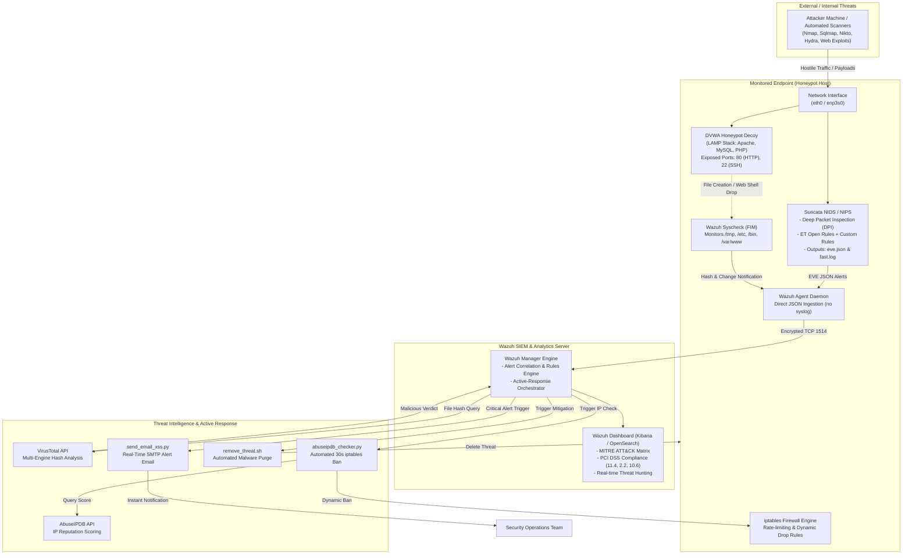

# 🛡️ Détection d’Intrusion et Analyse des Menaces via Honeypots
### *Advanced Multi-Layered IDS/IPS, SIEM Telemetry & Automated Threat Response Framework*

[](LICENSE)
[](https://suricata.io/)
[](https://wazuh.com/)
[](https://github.com/digininja/DVWA)
[](https://www.abuseipdb.com/)
[-purple.svg)](https://www.linux.org/)
[](https://clonezilla.org/)
[](README_FR.md)

---

## 📌 Context & Institutional Background

> [!NOTE]
> **Academic & Professional Internship Context**  
> This project was engineered and deployed during an **End-of-Year Engineering Internship (*Stage d'Ingénieur*)** from **July 1, 2025, to July 31, 2025**, within the Information Systems Department (*Département Informatique*) of the **Agence du Bassin Hydraulique du Tensift ([ABHT](https://abht.ma/))**, Marrakech, Morocco.  
> 
> - **Author / Security Engineer:** **Sayf eddine Laamri**  
> - **Academic Institution:** **École Nationale des Sciences Appliquées de Marrakech ([ENSA Marrakech](https://ensa.uca.ma/))**, **Université Cadi Ayyad (UCA)**  
> - **Degree & Major:** *Diplôme d'Ingénieur d'État en Génie Cyber-Défense et Systèmes de Télécommunications Embarqués* (**GCDSTE**)  
> - **Company Mentors / Supervisors:** **M. Hicham Errafiy**, **M. Abdelkarim Damhari**, **Mme Fatiha Choukri**

### 🏢 Mission & National Security Significance at ABHT
The **Agence du Bassin Hydraulique du Tensift (ABHT)** is a Moroccan public establishment created by Decree No. 2-00-479 pursuant to Article 20 of the Moroccan Water Act (*Loi sur l'eau*). The agency manages vital water resources, hydrological monitoring stations, telemetry systems, and public electronic services across several ecologically and economically strategic provinces of Morocco.

Under Morocco's national cybersecurity legislation (**Law No. 05-20**) governed by the **DGSSI** (*Direction Générale de la Sécurité des Systèmes d'Information*), public utility infrastructures are designated as **Systèmes d'Information d'Importance Vitale (SIIV)**. Securing ABHT's information assets—such as its hydrological database, water GIS (*SIG hydrique*), and administrative web portals—is essential to guarantee national continuity and data confidentiality (in compliance with **Law No. 09-08** overseen by the **CNDP**).

The purpose of this project was to establish an **end-to-end, multi-tiered defensive framework**: detecting unauthorized intrusions in real time, deflecting adversaries into a controlled decoy honeypot, aggregating security events into an enterprise SIEM, querying external threat intelligence APIs, executing autonomous remediation actions (SOAR), and migrating the entire prototype to dedicated **bare-metal production hardware (V2P)**.

---

## 🎯 Key Objectives & Purpose

1. **Continuous Network Traffic Inspection**: Deploy **Suricata** as a multithreaded Network Intrusion Detection & Prevention System (NIDS/NIPS) performing Deep Packet Inspection (DPI) to identify malicious signatures, exploits, and anomalies in real time.
2. **Deceptive Defense via Honeypot Telemetry**: Expose an intentionally vulnerable, isolated honeypot (**DVWA - Damn Vulnerable Web Application**) running on a LAMP stack to attract malicious actors, capture attack vectors, and stress-test custom detection rules without jeopardizing operational production assets.
3. **Centralized Log Aggregation & Security Analytics (SIEM)**: Integrate **Wazuh** (Manager, Agent, and OpenSearch/Kibana Dashboard) to correlate network telemetry, host system events, and file integrity data under a unified single pane of glass mapped to **MITRE ATT&CK** and **PCI DSS** compliance standards.
4. **Threat Intelligence Enrichment**: Connect external security intelligence APIs (**AbuseIPDB** and **VirusTotal**) to cross-reference detected attacker IPs and file payloads against global threat repositories automatically.
5. **Autonomous Active Response & SOAR**: Transition from mere observation to active mitigation by executing automated defensive playbooks:
   - Dynamic **iptables** drops for hostile IP addresses.
   - Real-time quarantine and deletion of uploaded web shells and malicious binaries via `remove_threat.sh`.
   - Instant alerting dispatch to security administrators via custom authenticated SMTP scripts (`send_email_xss.py`).
6. **Workstation & Host Hardening**: Audit endpoint readiness (Windows 10 End-of-Life analysis vs. Windows 11 requirements) and orchestrate host-level defense via **Kaspersky Endpoint Security** with network packet rules.
7. **Industrial Bare-Metal Deployment (V2P)**: Migrate the fully tested virtual lab from **VMware Workstation** directly onto physical enterprise hardware using **Clonezilla**, fine-tuning kernel parameters, CPU instructions, network bindings, and Java JVM heaps for raw production performance.

---

## 🏛️ System Architecture

The architecture is deployed across a decoupled, distributed topology designed to eliminate single points of failure and resource contention:



---

## 🎥 Demonstration Video Showcase

All attack simulations, live detection workflows, active mitigations, and bare-metal migrations were captured during the internship. Below is the index of recorded proof-of-concept videos included in this repository:

| # | Video Demonstration Title | Local File | Duration | Resolution | Key Concepts Demonstrated | GitHub Watch Link |
| :-: | :--- | :--- | :-: | :-: | :--- | :--- |
| **01** | **Suricata Rule Testing & EVE JSON Log Stream** | `ScreenRec_250912_8944.mp4` | `02:44` | 1080p | Suricata syntax validation (`suricata -T`), multithreaded packet capture, `fast.log` inspection, structured EVE JSON output. | [▶ Watch Video](https://github.com/USERNAME/REPO/raw/main/ScreenRec_250912_8944.mp4) |
| **02** | **DVWA Honeypot Decoy Deployment & Configuration** | `ScreenRec_250912_51925.mp4` | `02:17` | 1080p | LAMP stack deployment, Apache virtual hosts, MariaDB schema configuration, exposing ports 80 & 22 as decoy services. | [▶ Watch Video](https://github.com/USERNAME/REPO/raw/main/ScreenRec_250912_51925.mp4) |
| **03** | **Wazuh SIEM Manager & Agent Cryptographic Exchange** | `ScreenRec_250912_68100.mp4` | `02:11` | 1080p | Distributed agent enrollment (`agent-auth` / `manage_agents`), direct `eve.json` localfile ingestion in `ossec.conf`, Kibana health checks. | [▶ Watch Video](https://github.com/USERNAME/REPO/raw/main/ScreenRec_250912_68100.mp4) |
| **04** | **Live Web Exploitation & SIEM Threat Hunting** | `ScreenRec_250912_74173.mp4` | `03:09` | 1080p | SQL Injection, Reflected XSS, and Nmap stealth scans against DVWA; real-time event mapping on Wazuh Dashboard (MITRE ATT&CK & PCI DSS). | [▶ Watch Video](https://github.com/USERNAME/REPO/raw/main/ScreenRec_250912_74173.mp4) |
| **05** | **Automated SOAR Responses: AbuseIPDB Ban & VirusTotal Purge** | `ScreenRec_250912_60984.mp4` | `04:39` | 1080p | Automated IP reputation lookup, dynamic `iptables` DROP, FIM backdoor detection, VirusTotal hash check, and automatic deletion via `remove_threat.sh`. | [▶ Watch Video](https://github.com/USERNAME/REPO/raw/main/ScreenRec_250912_60984.mp4) |
| **06** | **Bare-Metal V2P Migration & Hardware Production Tuning** | `ScreenRec_250914_40790.mp4` | `02:55` | 1080p | Clonezilla disk imaging (`device-image`), bare-metal deployment, GRUB recovery, interface rebinding (`eth0` $\to$ `enp3s0`), and Wazuh Indexer JVM heap optimization. | [▶ Watch Video](https://github.com/USERNAME/REPO/raw/main/ScreenRec_250914_40790.mp4) |

> [!TIP]
> **Instructions for GitHub Video Integration**:  
> To link these video files when hosting on GitHub:  
> 1. Keep the `.mp4` files in the repository root or place them into a `videos/` folder.  
> 2. Replace `USERNAME/REPO` in the markdown table above with your actual GitHub username and repository name.  
> 3. GitHub renders `.mp4` files natively in markdown using standard links or HTML tags:  
>    ```html
>    <video src="ScreenRec_250912_60984.mp4" controls width="100%"></video>
>    ```  
> 4. Since each video is between **8 MB and 32 MB**, all files reside comfortably below GitHub's **100 MB per-file limit** and can be pushed directly without needing Git LFS.

---

## 💻 Included Scripts & Interactive Demo Suite

All scripts engineered during the internship are located in the `scripts/` directory. Each script features a dedicated `--demo` educational mode so reviewers and recruiters can immediately observe the workflow without requiring root privileges or live external accounts:

### 1. `scripts/abuseipdb_checker.py`
* **Purpose:** Queries AbuseIPDB v2 REST API to evaluate the threat confidence score of detected attacker IPs. If score $\ge 90\%$, injects a temporary 30-second ban in `iptables`.
* **Modes of Execution:**
  ```bash
  # Run interactive demo simulation (mock API & simulated iptables)
  python3 scripts/abuseipdb_checker.py --demo

  # Query a specific suspicious IP manually
  python3 scripts/abuseipdb_checker.py --ip 179.43.189.98 --threshold 90 --duration 30

  # Production execution via Wazuh Active Response
  cat alert.json | python3 scripts/abuseipdb_checker.py
  ```

### 2. `scripts/send_email_xss.py`
* **Purpose:** Dispatches real-time incident alert notifications to the SOC administrator inbox via Google SMTP TLS using application-specific credentials upon critical web attack detection.
* **Modes of Execution:**
  ```bash
  # Run email formatting and dry-run dispatch demo
  python3 scripts/send_email_xss.py --demo

  # Inspect generated HTML and plaintext payload without connecting to SMTP
  python3 scripts/send_email_xss.py --dry-run < alert.json
  ```

### 3. `scripts/remove_threat.sh`
* **Purpose:** Triggered by Wazuh Active Response when VirusTotal confirms a file is a Trojan, backdoor, or web shell. Performs an `execd` handshake, safely validates the path, purges the malicious file, and writes an audit log.
* **Modes of Execution:**
  ```bash
  # Execute standalone malware creation, detection & purge demonstration
  chmod +x scripts/remove_threat.sh
  ./scripts/remove_threat.sh --demo
  ```

### 4. `scripts/simulate_attacks.py`
* **Purpose:** Cross-platform attack validation suite replicating all 8 attack scenarios executed during the internship (Ping reconnaissance, Nmap SYN scan, FTP probing, Hydra SSH brute-forcing, DVWA SQLi, Reflected XSS, LFI/Path Traversal, and Web Shell drop).
* **Modes of Execution:**
  ```bash
  # Run full educational simulation showcasing attack payloads and expected SIEM alerts
  python3 scripts/simulate_attacks.py --demo

  # Launch simulation against a live honeypot endpoint
  python3 scripts/simulate_attacks.py --target 192.168.184.130
  ```

### 5. `scripts/v2p_post_migration.sh`
* **Purpose:** Automates bare-metal post-cloning adjustments (interface rebinding, JVM memory tuning in `jvm.options`, Suricata CPU instruction alignment, and service restarts).
* **Modes of Execution:**
  ```bash
  # Review the automated reconfiguration steps in simulation mode
  chmod +x scripts/v2p_post_migration.sh
  ./scripts/v2p_post_migration.sh --demo

  # Execute on bare-metal target system (requires root)
  sudo ./scripts/v2p_post_migration.sh
  ```

---

## ⚙️ Core Technical Components & Engineering Details

### 1. Suricata: Multithreaded Network IDS / IPS
- **Capture Engine**: High-performance packet capture operating in `af-packet` mode across the primary interface (`eth0`, rebound to `enp3s0` on bare metal).
- **Log Architecture (`/etc/suricata/suricata.yaml`)**:
  - Direct JSON telemetry enabled via `outputs.eve-log` to `/var/log/suricata/eve.json`.
  - Rapid console inspection enabled via `/var/log/suricata/fast.log`.
- **Custom Rule Engineering (`configs/suricata/local.rules`)**:
  ```suricata
  # ICMP Reconnaissance Detection & Prevention
  alert icmp any any -> any any (msg:"Ping ICMP détecté"; sid:1000001; rev:1;)
  drop icmp any any -> any any (msg:"Ping ICMP bloqué (Mode IPS)"; sid:1000002; rev:1;)

  # TCP SYN Stealth Scan Detection (Nmap)
  alert tcp any any -> any any (flags:S; msg:"Scan Nmap détecté (SYN Scan)"; sid:1000003; rev:1;)

  # Cleartext & Sensitive Service Probing
  alert tcp any any -> any 21 (msg:"Connexion FTP non chiffrée détectée"; sid:1000004; rev:1;)
  alert tcp any any -> any 22 (msg:"Connexion SSH détectée - Surveillance Brute Force"; sid:1000005; rev:1;)

  # Web Application Attack Signatures
  alert http any any -> any any (msg:"CUSTOM XSS Detected (Script tag injection)"; content:"<script>"; nocase; http_uri; classtype:web-application-attack; sid:1000100; rev:1;)
  alert http any any -> any any (msg:"CUSTOM SQL Injection Attempt (Authentication bypass)"; content:"' OR '1'='1"; nocase; http_client_body; classtype:web-application-attack; sid:1000111; rev:1;)
  alert http any any -> any any (msg:"CUSTOM LFI Attempt (Directory traversal)"; content:"../../"; http_uri; classtype:web-application-attack; sid:1000021; rev:1;)
  alert http any any -> any any (msg:"CUSTOM LFI Attempt (/etc/passwd access)"; content:"/etc/passwd"; http_uri; classtype:web-application-attack; sid:1000022; rev:1;)
  alert http any any -> any any (msg:"CUSTOM RFI Attempt (Remote HTTP include)"; content:"http://"; http_uri; classtype:web-application-attack; sid:1000023; rev:1;)
  ```

### 2. DVWA Honeypot Decoy Configuration
- **Stack**: Linux + Apache 2.4 + MySQL (MariaDB) + PHP 8.x in `/var/www/html/dvwa`.
- **Decoy Objective**: Intentionally open port 80 (HTTP) and port 22 (SSH) on an isolated VM/host to lure adversaries away from agency servers while monitoring malicious traffic.
- **Simulated Attack Vectors**:
  - SQL Injections (authentication bypass `' OR 1=1 --`).
  - Stored & Reflected Cross-Site Scripting (`<script>alert(1)</script>`).
  - Path Traversal & Local File Inclusion (`/etc/passwd`).
  - Remote File Inclusion (`http://evil.com/payload.txt`).
  - SSH dictionary brute-force attacks using **Hydra**.
  - Automated network reconnaissance using **Nmap**, **Nikto**, and **WPScan**.
  - Malicious PHP web shell backdoor uploads.

### 3. Wazuh SIEM: Distributed Host & Network Telemetry
- **Decoupled Architecture**: Wazuh Manager (Ubuntu Server) and Wazuh Agent (Kali Honeypot).
- **Direct JSON Ingestion Pipeline**: Ingestion of Suricata's `eve.json` via native JSON collector in `/var/ossec/etc/ossec.conf`:
  ```xml
  <localfile>
    <log_format>json</log_format>
    <location>/var/log/suricata/eve.json</location>
  </localfile>
  ```
- **File Integrity Monitoring (FIM / Syscheck)**: Real-time file system surveillance over sensitive operating directories (`/etc`, `/usr/bin`, `/sbin`, `/home`, `/tmp`, `/var/www`):
  ```xml
  <syscheck>
    <frequency>43200</frequency>
    <scan_on_start>yes</scan_on_start>
    <directories check_all="yes" realtime="yes">/etc,/usr/bin,/usr/sbin</directories>
    <directories check_all="yes" realtime="yes">/home,/tmp,/var/www/html</directories>
  </syscheck>
  ```
- **Kibana / OpenSearch Analytics**: Real-time dashboards visualizing agent health, severity distribution (Levels 0-15+), MITRE ATT&CK adversary tactics mapping, and PCI DSS compliance (Requirements 2.2, 11.4, 10.6.1, 6.5).

### 4. Workstation & Endpoint Security Hardening
- **Windows 10 EOL Readiness Audit**: Evaluated administrative workstations at ABHT in view of the upcoming Windows 10 End-of-Life (October 2025). Checked hardware readiness against Windows 11 prerequisites (TPM 2.0, Secure Boot, UEFI firmware, 64-bit multi-core CPU).
- **Kaspersky Endpoint Protection**: Configured antivirus agent management via My Kaspersky, enabling heuristic behavioral analysis, network exploit prevention, and packet-level firewall filtering rules.

### 5. Bare-Metal Virtual-to-Physical (V2P) Migration
- **Cloning via Clonezilla**: Executed `fsck` file system checks, captured a complete `device-image` of the virtual machine disk (`/dev/sda`) onto external storage, and restored it directly onto the internal physical drive of a bare-metal computer.
- **Hardware Adaptation & Tuning**:
  - Aligned Suricata CPU instruction sets to physical CPU architecture.
  - Re-mapped virtual network interfaces (`eth0` $\to$ `enp3s0`).
  - Synchronized Wazuh agent keys via `manage_agents` and `client.keys`.
  - Optimized Wazuh Indexer Java Virtual Machine memory heap in `/etc/wazuh-indexer/jvm.options`.

---

## 🏆 Key Competencies Acquired & Engineering Valorization

| Competency Domain | Concrete Skills & Technologies Mastered |
| :--- | :--- |
| **Network Security & DPI** | Compiling, tuning, and operating **Suricata**; writing custom rule signatures for web vulnerabilities (SQLi, XSS, RFI/LFI, SSRF); configuring `af-packet` inline IPS; analyzing packet pcaps. |
| **SIEM & Security Analytics** | Deploying distributed **Wazuh** architectures; configuring agent-manager cryptographic authentication; integrating non-syslog JSON log streams; building OpenSearch dashboards. |
| **SOC Operations & Compliance** | Mapping security incidents to the **MITRE ATT&CK** matrix; monitoring audit compliance against **PCI DSS** (sections 2.2, 11.4, 10.6, 6.5); triaging alerts by severity. |
| **Automated Response (SOAR)** | Writing custom active-response scripts in **Python** and **Bash** (`abuseipdb_checker.py`, `remove_threat.sh`, `send_email_xss.py`); automating firewall IP bans and malware purging. |
| **Threat Intelligence Integration** | Operationalizing public and commercial REST APIs (**AbuseIPDB**, **VirusTotal**); parsing JSON payloads under real-time network constraints; managing API quotas. |
| **Deception Technology** | Deploying and configuring **DVWA** as a honeypot decoy on a LAMP stack; simulating realistic cyberattacks (Nmap, Hydra, sqlmap, Nikto) to validate detection efficacy. |
| **Endpoint Security & Hardening**| Auditing enterprise workstations; planning OS life-cycle migrations (Windows 10 to 11); managing **Kaspersky** endpoint protection and host firewall rules. |
| **Systems & Disaster Recovery** | Performing bare-metal **Virtual-to-Physical (V2P)** system migrations with **Clonezilla**; GRUB bootloader recovery; JVM memory tuning; hardware interface management. |
| **Institutional Governance** | Aligning technical implementations with national cybersecurity frameworks (**DGSSI**, **Loi 05-20**, **Loi 09-08 / CNDP**) to protect critical water resources at **ABHT**. |

---

## 📂 Repository Hierarchy

```text
.
├── rapport_du_stage-2 (1).pdf       # Official Engineering Internship Report (86 pages)
├── README.md                        # Master Project Documentation & Technical Overview (English)
├── README_FR.md                     # Documentation Complète du Projet de Stage (Français)
├── configs/                         # Production-Ready Configuration Files
│   ├── suricata/
│   │   └── local.rules              # Custom Suricata detection & prevention signatures
│   └── wazuh/
│       └── local_rules.xml          # Wazuh correlation rules, XSS email trigger, VirusTotal FIM
├── scripts/                         # Automated Mitigation & Threat Intelligence Suite
│   ├── abuseipdb_checker.py         # AbuseIPDB API reputation check & dynamic iptables drop
│   ├── remove_threat.sh             # Active response: VirusTotal confirmed malware auto-delete
│   ├── send_email_xss.py            # Active response: Authenticated SMTP security alert email
│   ├── simulate_attacks.py          # Interactive attack simulation & validation suite
│   └── v2p_post_migration.sh        # Bare-metal V2P reconfiguration & JVM optimization script
└── videos/ (or Root)                # Demonstration Recordings (1080p Full HD)
    ├── ScreenRec_250912_8944.mp4    # Video 1: Suricata Rule Testing & EVE JSON Log Analysis
    ├── ScreenRec_250912_51925.mp4   # Video 2: DVWA Honeypot Deployment & Decoying
    ├── ScreenRec_250912_68100.mp4   # Video 3: Wazuh Distributed Architecture Integration
    ├── ScreenRec_250912_74173.mp4   # Video 4: Attack Simulation Telemetry & Wazuh Dashboard
    ├── ScreenRec_250912_60984.mp4   # Video 5: Automated AbuseIPDB Ban & VirusTotal Malware Purge
    └── ScreenRec_250914_40790.mp4   # Video 6: Bare-Metal V2P Migration & Hardware Tuning
```

---

## 📜 Regulatory & Standards Compliance Alignment

| Standard / Framework | Application in this Project |
| :--- | :--- |
| **Moroccan Law No. 05-20** | Enforcing proactive cyber-defense on vital information systems (**SIIV**) at ABHT under **DGSSI** directives. |
| **Moroccan Law No. 09-08** | Ensuring personal data confidentiality and integrity overseen by the **CNDP**. |
| **MITRE ATT&CK** | Direct telemetry mapping of adversary tactics (*Reconnaissance*, *Initial Access*, *Execution*, *Persistence*, *Defense Evasion*). |
| **PCI DSS 11.4** | Implementation of network intrusion detection/prevention systems (Suricata). |
| **PCI DSS 2.2** | Hardening system configurations and endpoint auditing. |
| **PCI DSS 10.6.1** | Continuous automated log collection and daily review via Wazuh SIEM. |
| **PCI DSS 6.5 & 6.3.7** | Defending against web application flaws (SQLi, XSS, CSRF, RFI/LFI). |

---

## 🤝 Acknowledgments & Institutional Credits

I wish to express my deepest appreciation to:
- **Agence du Bassin Hydraulique du Tensift (ABHT)**, particularly the team of the **Département Informatique**, for their warm welcome, professional guidance, and for providing enterprise-grade infrastructure to conduct this work.
- My internship supervisors: **M. Hicham Errafiy**, **M. Abdelkarim Damhari**, and **Mme Fatiha Choukri**, for their availability, continuous mentorship, and expert feedback throughout the project.
- The administration, faculty, and professors of **ENSA Marrakech** and **Université Cadi Ayyad**, especially the instructors of the **GCDSTE** program, for imparting the solid technical and engineering fundamentals that enabled the successful delivery of this project.

---

<p align="center">
  <b>Sayf eddine Laamri</b> • ENSA Marrakech • Filière GCDSTE • ABHT Internship Project (2025)<br/>
  <i>Dedicated to the cyber-defense and operational resilience of national critical infrastructure.</i>
</p>
