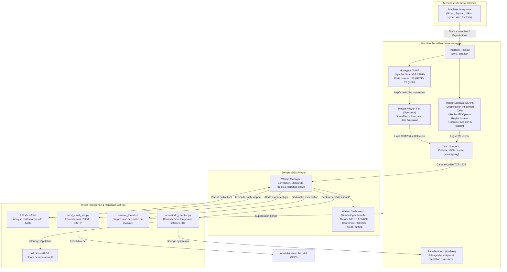

# 🛡️ Détection d’Intrusion et Analyse des Menaces via Honeypots
### *Architecture Avancée IDS/IPS, Télémétrie SIEM & Réponse Automatisée aux Incidents*

[](LICENSE)
[](https://suricata.io/)
[](https://wazuh.com/)
[](https://github.com/digininja/DVWA)
[](https://www.abuseipdb.com/)
[-purple.svg)](https://www.linux.org/)
[](https://clonezilla.org/)
[](README.md)

---

## 📌 Contexte Institutionnel & Réalisation du Stage

> [!NOTE]
> **Cadre Universitaire et Professionnel du Stage**  
> Ce projet a été conçu, déployé et validé lors de mon **Stage d'Ingénieur de Fin d'Année**, effectué du **01 juillet 2025 au 31 juillet 2025** au sein du Département Informatique de l'**Agence du Bassin Hydraulique du Tensift ([ABHT](https://abht.ma/))** à Marrakech.  
> 
> - **Auteur / Élève Ingénieur :** **Sayf eddine Laamri**  
> - **Établissement Universitaire :** **École Nationale des Sciences Appliquées de Marrakech ([ENSA Marrakech](https://ensa.uca.ma/))**, **Université Cadi Ayyad (UCA)**  
> - **Filière :** *Génie Cyber-Défense et Systèmes de Télécommunications Embarqués* (**GCDSTE**)  
> - **Encadrants Professionnels :** **M. Hicham Errafiy**, **M. Abdelkarim Damhari**, **Mme Fatiha Choukri**

### 🏢 Enjeux Stratégiques et Sécurité à l'ABHT
L'**Agence du Bassin Hydraulique du Tensift (ABHT)** est un établissement public marocain instauré par le décret n° 2-00-479, en application de l’article 20 de la Loi sur l’eau. L'agence assure la gestion intégrée, la planification, le suivi quantitatif/qualitatif et la protection des ressources hydriques sur un bassin stratégique et sensible.

Dans le cadre de la transition numérique et de la protection des infrastructures critiques — classées comme **Systèmes d'Information d'Importance Vitale (SIIV)** selon la **Loi n° 05-20** relative à la cybersécurité et pilotées par la **DGSSI** (*Direction Générale de la Sécurité des Systèmes d'Information*) —, les services numériques de l'ABHT (SIG hydrique, gestion documentaire, bases de données métiers, serveurs applicatifs) nécessitent une surveillance proactive face aux cyberattaques.

L'objectif de ce stage était de concevoir, implémenter et évaluer une plateforme complète de détection d'intrusions (**IDS/IPS Suricata**), de corrélation centralisée (**SIEM Wazuh**), d'attraction par leurre (**Honeypot DVWA**), d'enrichissement par **Threat Intelligence (AbuseIPDB et VirusTotal)**, de remédiation automatisée (**SOAR**), et de réaliser une migration vers serveur physique (**V2P**).

---

## 🎯 Objectifs et Finalité du Projet

1. **Surveillance Réseau en Temps Réel** : Analyser les flux réseau avec **Suricata** en mode Deep Packet Inspection (DPI) pour intercepter signatures malveillantes, scans et exploitations de failles.
2. **Attraction et Analyse via Honeypot** : Déployer **DVWA (Damn Vulnerable Web Application)** sur pile LAMP pour attirer les cyberattaques réelles en environnement isolé et tester l'efficacité des règles défensives sans compromettre les systèmes réels.
3. **Centralisation et Corrélation SIEM** : Utiliser **Wazuh** (Manager, Agent et Dashboard OpenSearch/Kibana) pour corréler les alertes réseau (Suricata), les journaux système et les modifications de fichiers, avec cartographie vers **MITRE ATT&CK** et exigences **PCI DSS**.
4. **Enrichissement par Threat Intelligence** : Connecter les APIs publiques **AbuseIPDB** et **VirusTotal** pour évaluer la réputation des adresses IP attaquantes et des fichiers suspects en temps réel.
5. **Réponse Active et Automatisation (SOAR)** :
   - Blocage temporaire et dynamique des IP hostiles via **iptables**.
   - Suppression automatique des web shells et malwares détectés via le script `remove_threat.sh`.
   - Notification critique immédiate à l'administrateur par email SMTP sécurisé via `send_email_xss.py`.
6. **Sécurisation du Poste de Travail** : Audit de conformité des postes utilisateurs face à la fin de support de Windows 10 (migration Windows 11 / TPM 2.0) et renforcement avec **Kaspersky Endpoint Security** et filtrage pare-feu.
7. **Migration vers Matériel Physique (V2P)** : Cloner et adapter l'architecture virtualisée (VMware) sur machine physique dédiée à l'aide de **Clonezilla**, avec réajustement des interfaces, clés cryptographiques et mémoire JVM.

---

## 🏛️ Architecture Globale du Système



---

## 🎥 Galerie des Vidéos de Démonstration

L'ensemble des phases expérimentales, simulations d'attaques, détections en temps réel, réponses actives et opérations de migration ont été enregistrées sous forme de vidéos de démonstration (Full HD 1080p). Voici le tableau récapitulatif des vidéos disponibles dans ce dépôt :

| # | Titre de la Démonstration Vidéo | Fichier Local | Durée | Résolution | Éléments et Protocoles Démontrés | Lien de Visionnage GitHub |
| :-: | :--- | :--- | :-: | :-: | :--- | :--- |
| **01** | **Vérification de Suricata & Flux EVE JSON** | `ScreenRec_250912_8944.mp4` | `02:44` | 1080p | Validation syntaxique (`suricata -T`), capture de trafic multithread, analyse directe de `fast.log` et du flux structuré `eve.json`. | [▶ Voir la Vidéo](https://github.com/USERNAME/REPO/raw/main/ScreenRec_250912_8944.mp4) |
| **02** | **Déploiement du Honeypot DVWA & Exposition** | `ScreenRec_250912_51925.mp4` | `02:17` | 1080p | Installation de la pile LAMP, configuration de MariaDB, déploiement de DVWA dans `/var/www/html/` et paramétrage des ports appâts (80 et 22). | [▶ Voir la Vidéo](https://github.com/USERNAME/REPO/raw/main/ScreenRec_250912_51925.mp4) |
| **03** | **Intégration Distribuée Wazuh Manager & Agent** | `ScreenRec_250912_68100.mp4` | `02:11` | 1080p | Échange de clés cryptographiques (`agent-auth`), configuration de la collecte JSON directe dans `ossec.conf`, validation sur le dashboard web. | [▶ Voir la Vidéo](https://github.com/USERNAME/REPO/raw/main/ScreenRec_250912_68100.mp4) |
| **04** | **Simulations d'Attaques & Télémétrie SIEM** | `ScreenRec_250912_74173.mp4` | `03:09` | 1080p | Injections SQL, attaques XSS réfléchies et scans Nmap furtifs contre DVWA ; visualisation en direct sur le Dashboard Wazuh (MITRE ATT&CK et PCI DSS). | [▶ Voir la Vidéo](https://github.com/USERNAME/REPO/raw/main/ScreenRec_250912_74173.mp4) |
| **05** | **Réponses Actives SOAR : Ban AbuseIPDB & Purge VirusTotal** | `ScreenRec_250912_60984.mp4` | `04:39` | 1080p | Interrogation automatique d'AbuseIPDB, ban dynamique iptables (30s), détection FIM dans `/tmp`, verdict VirusTotal et suppression via `remove_threat.sh`. | [▶ Voir la Vidéo](https://github.com/USERNAME/REPO/raw/main/ScreenRec_250912_60984.mp4) |
| **06** | **Migration Physique V2P & Optimisation Système** | `ScreenRec_250914_40790.mp4` | `02:55` | 1080p | Clonage disque Clonezilla, restauration sur PC physique, réparation GRUB, renommage d'interface (`eth0` $\to$ `enp3s0`), et réglage de la mémoire JVM du Wazuh Indexer. | [▶ Voir la Vidéo](https://github.com/USERNAME/REPO/raw/main/ScreenRec_250914_40790.mp4) |

> [!TIP]
> **Instructions pour l'hébergement GitHub** :  
> - Pour activer les liens de visionnage, remplacez `USERNAME/REPO` par vos identifiants réels GitHub.  
> - Toutes les vidéos pèsent entre **8 Mo et 32 Mo**, ce qui respecte la limite de 100 Mo par fichier de GitHub et permet de les pousser directement sur le dépôt.

---

## 💻 Scripts Opérationnels & Modes Démonstration

L'ensemble des scripts développés pendant le stage est regroupé dans le dossier `scripts/`. Chaque script dispose d'un argument `--demo` permettant de reproduire et vérifier le fonctionnement immédiatement en mode démonstration sans nécessiter de privilèges administrateur :

### 1. `scripts/abuseipdb_checker.py`
* **Finalité :** Interroge l'API REST v2 d'AbuseIPDB pour évaluer le score de réputation de l'IP attaquante. Si le score $\ge 90\%$, déclenche un bannissement temporaire de 30 secondes via `iptables`.
* **Commandes de test :**
  ```bash
  # Lancer la démonstration interactive (API simulée & iptables dry-run)
  python3 scripts/abuseipdb_checker.py --demo

  # Tester manuellement une IP suspecte
  python3 scripts/abuseipdb_checker.py --ip 179.43.189.98 --threshold 90 --duration 30

  # Exécution réelle déclenchée par Wazuh Active Response
  cat alert.json | python3 scripts/abuseipdb_checker.py
  ```

### 2. `scripts/send_email_xss.py`
* **Finalité :** Envoi en temps réel d'un e-mail d'alerte critique formaté en HTML et texte brut à l'administrateur de sécurité dès qu'une attaque web sévère (XSS, SQLi) est détectée sur le honeypot.
* **Commandes de test :**
  ```bash
  # Lancer la démonstration de génération d'e-mail d'alerte
  python3 scripts/send_email_xss.py --demo

  # Tester l'extraction de métadonnées sans envoi réseau
  python3 scripts/send_email_xss.py --dry-run < alert.json
  ```

### 3. `scripts/remove_threat.sh`
* **Finalité :** Script Bash invoqué par Wazuh Active Response lorsque l'API VirusTotal confirme la présence d'un malware dans un répertoire surveillé (règle 100500). Supprime de manière sécurisée le fichier malveillant et enregistre l'opération dans les journaux d'audit.
* **Commandes de test :**
  ```bash
  # Lancer la simulation de création, détection et purge de malware
  chmod +x scripts/remove_threat.sh
  ./scripts/remove_threat.sh --demo
  ```

### 4. `scripts/simulate_attacks.py`
* **Finalité :** Suite de validation multiplateforme reproduisant les 8 scénarios d'attaques documentés dans le rapport de stage (Ping, scans Nmap furtifs, sondes FTP, brute force SSH Hydra, SQLi, XSS réfléchi, LFI et dépôt de web shell).
* **Commandes de test :**
  ```bash
  # Afficher la démonstration pédagogique des 8 scénarios d'attaque
  python3 scripts/simulate_attacks.py --demo

  # Exécuter les scénarios contre une machine honeypot cible
  python3 scripts/simulate_attacks.py --target 192.168.184.130
  ```

### 5. `scripts/v2p_post_migration.sh`
* **Finalité :** Automatisation des ajustements système post-migration V2P (réassignation des interfaces réseau, réglage de la mémoire JVM du Wazuh Indexer, adaptation des instructions CPU Suricata et redémarrage des daemons).
* **Commandes de test :**
  ```bash
  # Simuler les étapes de reconfiguration matérielle
  chmod +x scripts/v2p_post_migration.sh
  ./scripts/v2p_post_migration.sh --demo

  # Exécution réelle sur serveur physique (nécessite les droits root)
  sudo ./scripts/v2p_post_migration.sh
  ```

---

## ⚙️ Détails des Réalisations Techniques

### 1. Suricata : Moteur IDS / IPS
- **Mode d'écoute** : Analyse multithreadée via `af-packet` sur interface active (`eth0` sous VM, réassignée à `enp3s0` sur machine physique).
- **Format de journalisation** : Activation de l'EVE JSON (`/var/log/suricata/eve.json`) permettant une structure complète des métadonnées (IP source, port, protocole, classification d'alerte).
- **Gestion des règles** :
  - Mise à jour automatique des signatures communautaires via `suricata-update` (*Emerging Threats Open*).
  - Rédaction de signatures personnalisées (`configs/suricata/local.rules`) :
    - Détection ICMP (`sid:1000001`) et blocage en mode IPS (`drop icmp ... sid:1000002`).
    - Détection des scans SYN furtifs Nmap (`flags:S; sid:1000003`).
    - Surveillance des accès non chiffrés FTP (`port 21`) et SSH (`port 22`).
    - Identification ciblée des attaques web : injections SQL, XSS, inclusions de fichiers (LFI/RFI) et SSRF.

### 2. Déploiement du Honeypot DVWA
- Déployé sur pile **LAMP** (Linux Apache MySQL PHP) dans `/var/www/html/dvwa`.
- Configuration de ports attractifs pour susciter des actions d'exploration et d'exploitation de la part des attaquants.
- **Scénarios d'attaques simulés et validés** :
  - **Injections SQL (SQLi)** : Contournement d'authentification (`' OR '1'='1`).
  - **Cross-Site Scripting (XSS)** : Injection de balises de script dans les paramètres de formulaires.
  - **Inclusion de fichiers (LFI / RFI)** : Tentatives d'extraction de `/etc/passwd` et appels de scripts distants.
  - **Brute force SSH** : Simulation via l'outil **Hydra** sur le port 22.
  - **Scans de vulnérabilités** : Analyse via **Nmap** (`-sV --script vuln`), **Nikto** et **WPScan**.
  - **Dépôt de Web Shell** : Upload de backdoors PHP dans les répertoires temporaires (`/tmp`).

### 3. Wazuh SIEM : Collecte, Corrélation et Visualisation
- **Architecture distribuée** : Séparation stricte entre le **Wazuh Manager** (Ubuntu Server) et le **Wazuh Agent** (Kali Linux hébergeant le honeypot).
- **Intégration directe des logs Suricata** : Configuration de `<localfile>` au format `json` dans `ossec.conf` pour ingérer directement `eve.json` sans goulot d'étranglement syslog.
- **Surveillance d'Intégrité des Fichiers (FIM / Syscheck)** : Surveillance en temps réel des dossiers sensibles (`/etc`, `/bin`, `/tmp`, `/var/www/html`).
- **Supervision via le Dashboard** :
  - Synthèse des alertes sur 24 heures classées par niveau de sévérité (Niveau 0 à 15+).
  - Corrélation automatique avec le framework **MITRE ATT&CK**.
  - Vérification de la conformité aux exigences **PCI DSS** (normes 2.2, 11.4, 10.6.1, 6.5).

### 4. Sécurisation du Poste Utilisateur & Migration V2P
- **Audit de conformité Windows** : Analyse du parc face à la fin de support de Windows 10 (octobre 2025) et vérification des critères d'éligibilité à Windows 11 (TPM 2.0, Secure Boot, UEFI).
- **Kaspersky Endpoint Security** : Déploiement et gestion centralisée via My Kaspersky, activation de la détection comportementale et règles de pare-feu applicatif.
- **Migration V2P avec Clonezilla** : Sauvegarde d'image disque de la machine virtuelle, restauration sur machine physique, mise à jour du gestionnaire de démarrage GRUB, et reconfiguration post-migration.

---

## 🏆 Compétences Développées & Valorisation

| Domaine de compétence | Acquis et Réalisations Concrètes |
| :--- | :--- |
| **Sécurité Réseau (DPI & IDS/IPS)** | Maîtrise de Suricata, rédaction de signatures personnalisées (syntaxe Snort/Suricata), fonctionnement inline IPS avec Netfilter. |
| **Ingénierie SIEM & SOC** | Déploiement distribué Wazuh Manager/Agent, corrélation multi-sources, conception de règles XML, monitoring Kibana/OpenSearch. |
| **Automatisation & SOAR** | Développement de scripts de remédiation en Python et Bash, intégration avec iptables, automatisation de suppression de malwares et alertes SMTP. |
| **Threat Intelligence** | Exploitation d'APIs de réputation (AbuseIPDB, VirusTotal), enrichissement en temps réel, gestion des quotas d'interrogation. |
| **Technologies de Déception** | Déploiement d'un Honeypot DVWA, analyse comportementale des attaquants, simulation d'attaques avec Nmap, Hydra, sqlmap. |
| **Sécurisation des Postes Clients** | Audit du cycle de vie du parc Windows (fin de support Windows 10, exigences Windows 11), administration de Kaspersky Endpoint Security. |
| **Administration Système & V2P** | Clonage de systèmes d'exploitation avec Clonezilla, résolution de conflits de pilotes et d'interfaces, optimisation de la mémoire Java (JVM). |
| **Cadre Réglementaire** | Compréhension et application des directives de la DGSSI, de la Loi 05-20 (SIIV) et de la Loi 09-08 (protection des données - CNDP). |

---

## 📂 Contenu et Ressources du Projet

- `rapport_du_stage-2 (1).pdf` : Rapport complet et officiel du stage (86 pages détaillant l'ensemble des protocoles, captures d'écran et analyses).
- `README.md` : Documentation technique complète en anglais pour vitrine GitHub.
- `README_FR.md` : Documentation technique complète en français pour soutenance académique.
- `scripts/abuseipdb_checker.py` : Script d'interrogation API AbuseIPDB et blocage pare-feu.
- `scripts/remove_threat.sh` : Script de suppression automatique des fichiers malveillants identifiés par VirusTotal.
- `scripts/send_email_xss.py` : Script d'envoi d'e-mails d'alerte critique par SMTP.
- `scripts/simulate_attacks.py` : Suite de simulation d'attaques et démonstration pédagogique.
- `scripts/v2p_post_migration.sh` : Script d'automatisation de la reconfiguration post-clonage V2P.
- `configs/suricata/local.rules` : Signatures Suricata personnalisées pour la détection et la prévention des attaques web et réseau.
- `configs/wazuh/local_rules.xml` : Règles de corrélation et déclencheurs de réponses actives pour Wazuh.
- Vidéos de démonstration (`ScreenRec_*.mp4`) : Enregistrements vidéo attestant du fonctionnement en direct des attaques simulées, des alertes Suricata, du dashboard Wazuh et des réponses automatisées.

---

<p align="center">
  <b>Sayf eddine Laamri</b> • ENSA Marrakech • Filière GCDSTE • Stage ABHT (2025)<br/>
  <i>Projet d'ingénierie dédié à la protection des infrastructures numériques critiques.</i>
</p>
